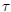
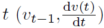
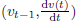
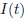
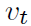
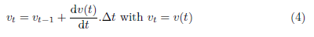
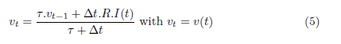

# Source neuro-5

## About 

Applications 

## Classes Structure

## Theoretical explanation 

### General differential equation

withthe postsynaptic potential amplitude,
the dirac function,
is the emission time of kth spike at
neuron j and D the transmission delay.

### Types of solutions

#### Forward Euler (explicit method)

#### Backward Euler (implicit method)

#### Analytical solution 

We discard the charging part of (1) solution. Thus, we consider that the
neuron is able to steeply rise its potential when there is an input of
current (modeled by equation (2)). Equation (3) comprises the discharge
of the capacity by an exponential decay with the time contant . 

#####Fixed-time stepping solutions

A simpler and faster way of stimulating those neurons with the same model
to use equation (1) and solve it with a fixed-time step. There are two
solutions. One can either compute the explicit solution (4) or the
implicit solution (5). Explicit method relies on everything that happened
before the time   and  to compute 
whereas implicit solution starts where  is on both sides of the equations.

Fixed-time stepping explicit solution

Fixed-time stepping implicit solution

## References

* Brunel´s 2000 model
