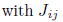

# Source neuro-5

## About 

Applications 

## Classes Structure


## Theoretical explanation 

### General differential equation


swe have seen so hahahahha


### Types of solutions

#### Forward Euler (explicit method)


```
Bblabla
```

#### Backward Euler (implicit method)


```

```

#### Analytical solution with fixed step 


```

```

#### Analytical solution with variable step 


```

```
## References

* Brunel´s 2000 model
