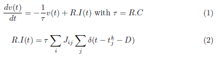
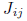
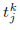
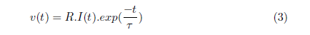

# Source neuro-5

## About 

Applications 

## Classes Structure


## Theoretical explanation 

### General differential equation

```

```

withthe postsynaptic potential amplitude,
the dirac function,
is the emission time of kth spike at
neuron j and D the transmission delay.


### Types of solutions

#### Forward Euler (explicit method)


```

```

#### Backward Euler (implicit method)

```

```

#### Analytical solution with fixed step 

```

```

#### Analytical solution with variable step 


```

```
## References

* Brunel´s 2000 model
